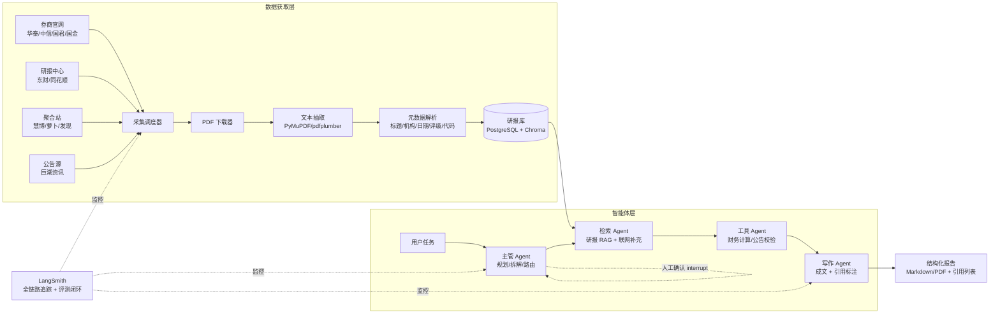
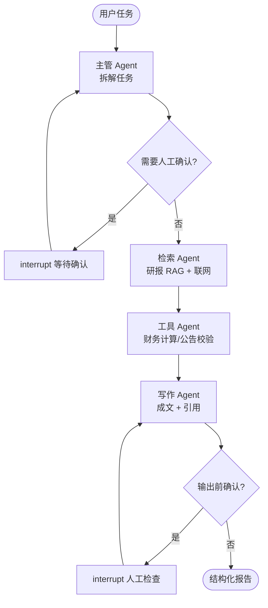

# AutoReport 自动研报系统 · 开发方案

> 版本：v2.0（整合 A 股研报数据获取层）
> 定位：基于 LangChain / LangGraph / LangSmith 构建的多智能体自动研报系统，核心特色是从**真实 A 股研报数据源**自动采集、解析、入库，并提供带引用溯源的研报问答与报告生成。
> 适用对象：计算机专业应届毕业生个人项目（简历亮点向）

---

## 1. 项目定义

**一句话**：用户输入一个主题（如"比亚迪 2026 年盈利预测"），系统自主完成 研报检索 → 多智能体分析 → 报告写作，输出**每一条结论都可追溯到具体券商研报原文**的结构化报告。

**与普通 LLM 项目的差异**：数据不是靠"听说"，而是来自真实可下载的券商研报 + 官方公告，引用可点击验证——这是面试官最容易被打动的点。

**简历亮点三件套**：

| 亮点 | 体现的能力 |
|---|---|
| 研报数据获取层（合规爬虫 + 解析 + 入库） | 工程化、爬虫、数据治理 |
| 多智能体编排（LangGraph） | Agent 架构设计、状态管理、人机协作 |
| 评测闭环（LangSmith） | 量化思维、质量工程 |

---

## 2. 总体架构



---

## 3. 数据源分层与合规策略（核心设计）

### 3.1 数据源登记表（基于调研整理）

| 层级 | 站点 | 入口 | 可获取内容 | 自动化级别 |
|---|---|---|---|---|
| **一级源** 券商官网 | 华泰研究 | research.htsc.com/research | 公司/行业/宏观研报，PDF 直接下载 | ✅ 可自动化（公开直链） |
| | 中信证券研究 | research.citics.com | 2400+ 公司，深度/投价/点评全类型 | ✅ 可自动化（公开直链） |
| | 国泰君安研究 | research.gtja.com | 多数报告免费下载 | ⚠️ 部分栏目需注册 |
| | 国金研究 | www.gjzq.com.cn → 研究报告 | 公司/行业/策略/宏观 | ✅ 可自动化 |
| **二级源** 综合研报中心 | 东方财富研报中心 | data.eastmoney.com/report | 按个股/行业/券商/评级筛；支持 PDF 直链（`pdf.dfcfw.com/pdf/H3_{infoCode}_1.pdf`） | ✅ 可自动化（直链格式稳定） |
| | 同花顺研报中心 | data.10jqka.com.cn/report | 个股研报板块可下完整 PDF | ⚠️ 部分需登录/VIP |
| **三级源** 聚合站 | 慧博投研 | www.hibor.com.cn | 券商公司/行业/宏观全 | ⚠️ 客户端 + 免费额度有限 |
| | 萝卜投研 | robo.datayes.com | 盈利模型、研报摘要 | ⚠️ 每日免费额度 |
| | 发现报告 | www.fxbaogao.com | 公司/行业/券商全，支持 PDF/Word | ⚠️ 免费额度 + VIP |
| **校验源** 官方公告 | 巨潮资讯 | www.cninfo.com.cn | 年报/半年报/问询函/定增预案，全免费 | ✅ 可自动化（官方公开接口） |

### 3.2 自动化分级原则（重要）

| 级别 | 处理方式 |
|---|---|
| ✅ 可自动化 | 公开、无需登录、服务条款允许的渠道。编写采集器，遵守 robots.txt 与访问频率限制（默认单源 ≥3 秒/请求，错峰运行） |
| ⚠️ 部分受限 | **不实现绕过登录/VIP 的自动化**。对需要登录的栏目，方案内置"人工下载 → 放入约定目录 → 系统自动导入解析"的工作流（`data/inbox/` 目录轮询），既合规又不阻塞流程 |
| 版权红线 | 研报版权归券商所有。本项目声明：**仅用于个人学习与研究，不二次分发、不商用**；入库时保留版权声明字段 |

### 3.3 快速凑 10 份本地研报的合规做法（首周数据启动）

1. 在东方财富或同花顺搜 1 只股票（如贵州茅台 / 宁德时代 / 比亚迪）
2. 研报页按时间倒序，逐篇点下载 PDF
3. 换 10 只不同行业的股票各下 1 份 → 得到 10 份不同公司研报
4. 全部放入 `data/inbox/` 目录，由系统自动解析入库
5. 同时用巨潮资讯下载对应公司年报 PDF，作为基本面校验数据

> 此做法避免"在某站批量打包下载"的版权与封禁风险，且每份研报来源清晰可溯源。

---

## 4. 研报数据模型与存储设计

### 4.1 元数据模型（`reports` 表）

| 字段 | 类型 | 说明 |
|---|---|---|
| `id` | UUID | 主键 |
| `title` | TEXT | 研报标题 |
| `org` | TEXT | 券商/机构名称 |
| `report_type` | TEXT | 深度 / 点评 / 行业 / 宏观 / 投价 |
| `stock_code` | TEXT | 关联股票代码（如 600519） |
| `stock_name` | TEXT | 股票名称 |
| `rating` | TEXT | 评级（买入/增持/中性…） |
| `target_price` | NUMERIC | 目标价（可空） |
| `publish_date` | DATE | 发布日期 |
| `source_site` | TEXT | 来源站点 |
| `source_url` | TEXT | 原始下载链接 |
| `local_path` | TEXT | 本地 PDF 路径 |
| `pdf_hash` | TEXT | 文件哈希（去重） |
| `page_count` | INT | 页数 |
| `status` | TEXT | pending / parsed / failed |
| `created_at` | TIMESTAMP | 入库时间 |

### 4.2 存储方案

- **结构化元数据**：PostgreSQL（或起步用 SQLite，后期迁移）
- **向量索引**：Chroma（本地起步）→ Milvus（进阶）
- **文本分块**：按章节结构分块（目录/标题识别），每块保留 `report_id + 页码` 关联——**页码是引用溯源的关键**

### 4.3 采集状态表（`crawl_jobs`）

记录每个采集任务：目标源、抓取页、状态、失败原因、重试次数。用于断点续采和成本控制。

---

## 5. 研报获取层模块设计

### 5.1 模块划分

```
data_ingestion/
├── crawlers/            # 各站点采集器（按源拆分，独立运行）
│   ├── htsc.py          # 华泰
│   ├── citics.py        # 中信
│   ├── eastmoney.py     # 东财（直链模式）
│   ├── cninfo.py        # 巨潮公告
│   └── inbox_watcher.py # 人工下载目录轮询导入
├── parsers/
│   ├── pdf_extract.py   # PyMuPDF 文本抽取（含表格）
│   ├── meta_parser.py   # 标题/评级/目标价正则 + LLM 辅助抽取
│   └── chunker.py       # 结构化分块（按章节 + 页码锚点）
├── storage/
│   ├── db.py            # SQLite/PostgreSQL 存取
│   └── vector_store.py  # Chroma 向量化入库
└── scheduler.py         # 调度：频率控制、去重、重试、断点续采
```

### 5.2 采集流水线

```
任务队列 → 源采集器（列表页）→ 提取 PDF 直链 → 去重（hash）→ 下载（限速/重试）
       → PDF 解析 → 元数据抽取 → 结构化入库 → 向量化入库 → 更新状态
```

**关键工程点（面试可讲）**：
- **幂等与断点续采**：按 `pdf_hash` 去重，中断后可从 `crawl_jobs` 恢复
- **限速与礼貌抓取**：单源并发 1-2，请求间隔 ≥3s，遵守 robots.txt
- **直链模式优先**：东财 `pdf.dfcfw.com/pdf/H3_{infoCode}_1.pdf` 格式稳定，是最好落地的采集目标
- **解析鲁棒性**：PDF 含扫描件时降级为 OCR（预留接口，不阻塞主流程）；表格抽取失败不丢弃整篇
- **增量更新**：按日期增量抓取新研报，支持定时任务（cron）每周更新

---

## 6. RAG 检索与引用溯源设计

### 6.1 检索链路

```
用户问题 → 查询改写（股票/指标抽取）→ 混合检索（向量 + 关键词/代码精确匹配）
        → 重排序（按日期 + 相关性）→ 上下文组装（带来源标注）
```

**领域特化**：A 股研报检索的关键不是语义相似，而是**实体匹配**——先解析出股票代码/名称/指标（如"毛利率"），用代码精确过滤，再用向量找相关内容。这一层是面试官会追问的细节。

### 6.2 引用溯源（防幻觉的核心）

- 每个回答段落末尾带引用角标 `[1] [2]`
- 引用列表 = `机构 + 研报标题 + 发布日期 + 页码`
- 输出 Markdown 时，引用可超链接到 `source_url`（或本地预览路径）
- **评测时抽查引用正确性**（见第 8 节）

### 6.3 公告校验（增值能力）

对研报中的关键财务数据，用巨潮年报做二次校验：抽取年报中"营业收入/净利润"实际值，与研报预测对比，输出"预测 vs 实际"偏差表——这是很出彩的差异化功能，属于"工具 Agent"的职责。

---

## 7. 多智能体编排（LangGraph 实现要点）

| 节点 | 职责 | 关键实现 |
|---|---|---|
| 主管 Agent | 理解任务、拆解子任务清单、条件路由 | 用 `create_agent` 构建规划节点；输出结构化 JSON 任务列表 |
| 检索 Agent | 研报库 RAG + 联网补充 | 调用第 6 节检索链路；工具：`search_reports()` `search_web()` |
| 工具 Agent | 财务计算、公告校验、时间处理 | 工具：`calc()` `verify_with_announcement()` |
| 写作 Agent | 组织成文、引用标注、格式输出 | 强制引用格式模板；Markdown 输出 |

**状态图设计**：



**人机协作（human-in-the-loop）**：
- 规划完成后 interrupt，让用户增删任务项
- 报告输出前 interrupt，人工确认引用是否合理
- 用 LangGraph 检查点实现中断续跑（支持中途退出、下次恢复）

---

## 8. 评测体系设计（LangSmith）

### 8.1 评测数据集（50-100 条）

| 类型 | 示例 | 数量 |
|---|---|---|
| 事实问答 | "华泰对岱美股份的最新评级是什么？目标价？" | 30 |
| 对比问答 | "对比中信和国泰君安对 XX 的盈利预测差异" | 20 |
| 引用校验 | "第 2 段引用的研报与页码是否正确" | 20 |
| 报告质量 | 对整份生成的研报评分（完整性/结构/数据准确性） | 10 |

### 8.2 指标定义

| 指标 | 计算方式 | 目标 |
|---|---|---|
| 检索命中率 | 标准答案对应的研报是否在 Top-5 | ≥ 85% |
| 回答准确率 | LLM-as-judge + 人工抽检 | ≥ 90% |
| 引用正确率 | 抽查引用是否真实对应来源内容 | ≥ 90% |
| 端到端成功率 | 完整流程无中断失败 | ≥ 80% |
| 单次成本 | token 用量 / 次 | ≤ ¥0.5 |

### 8.3 迭代闭环

```
建数据集 → 跑基线 → 分析失败案例 → 优化（prompt/检索参数/路由/分块策略）
       → 回归 → 记录"优化前 vs 优化后"对比 → 沉淀到 README
```

> **这是简历上最硬的数字来源**。例子："自建 80 条研报问答评测集，通过 LangSmith 评测闭环将引用正确率从 71% 提升至 93%。"

---

## 9. 开发计划（8 周，每周含里程碑与验证点）

| 周 | 主题 | 关键任务 | 里程碑 | 验证点 |
|---|---|---|---|---|
| W1 | 环境与最小链路 | Python/uv/Git 初始化；LangChain 1.0 + LangGraph Quickstart；跑通单 Agent + 工具 | 命令行问答可用 | 首次 commit + README 草图 |
| W2 | 研报数据导入（inbox） | 手下载 10 份研报到 `inbox/`；实现 PDF 解析、元数据抽取、入库 | 10 份研报入库，可查询 | 检索接口返回正确元数据 |
| W3 | 采集器开发 | 实现东财直链采集器（列表→直链→下载→入库）+ 巨潮公告采集；限速与去重 | 自动采集 ≥50 份研报 | 采集日志无重复、断点可续 |
| W4 | 研报 RAG | 结构化分块、向量化、混合检索 + 代码实体匹配、引用溯源 | 问答带引用可点击 | 20 条检索用例命中率 ≥ 80% |
| W5 | 多智能体编排 | StateGraph 搭主管/检索/工具/写作；检查点 + interrupt 人工确认 | 端到端自动生成研报 | 10 个端到端任务成功率 ≥ 70% |
| W6 | 公告校验 + 前端 Demo | 财务数据"预测 vs 实际"对比；Streamlit 展示 Agent 运行过程 | Web Demo 可演示 | 2 个演示案例脚本走通 |
| W7 | 评测闭环 | 建 80 条评测集；定义指标；LangSmith 跑基准 → 迭代优化 | 评测报告 + trace 截图 | 至少一轮"优化→提升"证据链 |
| W8 | 工程化与交付 | Docker 部署、CI 评测回归、错误处理、README 精修、演示视频 | 新机器按 README 可跑通 | 2 分钟演示视频 |

**时间分配建议**：每天 2-3 小时；若时间紧，W3（采集器）可降级为"inbox 导入 + 半自动下载脚本"，省 1 周。

---

## 10. 成本预算

| 项目 | 方案 | 预算 |
|---|---|---|
| LangSmith | Developer 免费计划（5000 trace/月，超出 $0.50/千条） | ¥0 |
| 模型 | Qwen-turbo / qwen-plus，评测用小模型 | ¥50-150（全程） |
| 向量库 / 框架 | Chroma + 开源组件 | ¥0 |
| 数据 | 研报/公告免费渠道 | ¥0 |
| 部署 | 本地 Docker；如需公网 Demo，轻量服务器 1 个月 | ¥30-50 |
| **合计** | | **≈ ¥100-200** |

---

## 11. 风险与应对

| 风险 | 应对 |
|---|---|
| 站点反爬 / 频率限制 | 限速、单源并发 ≤2、错峰、尊重 robots.txt；失败源降级为 inbox 人工导入 |
| PDF 解析失败（扫描件/复杂表格） | OCR 预留接口；表格失败不丢弃整篇；解析质量统计报告 |
| 模型幻觉（编造研报结论） | 强制引用溯源 + 引用正确率评测 + 公告校验兜底 |
| 版权合规 | 仅个人学习、不二次分发；受限内容走人工下载流程 |
| 时间超支 | W3 可降级；评测集先建 50 条即可闭环 |

---

## 12. 简历呈现与面试准备

### 项目描述（模板）

> **AutoReport 多智能体自动研报系统** | Python · LangGraph · LangChain 1.0 · LangSmith · RAG
> 构建"主管-检索-工具-写作"四智能体协作架构，自动完成 A 股研报采集、解析、检索分析与报告生成；
> 实现券商研报与巨潮公告双源数据层（日增量更新、去重与断点续采），回答引用可溯源到研报页码；
> 自建 80 条研报问答评测集，通过 LangSmith 评测闭环将引用正确率从 71% 提升至 93%，端到端任务成功率 85%；
> Docker 部署并提供在线 Demo，含"研报预测 vs 年报实际"偏差对比功能。

### 面试高频问题（提前准备）

1. 为什么用多智能体而不是单 Agent？任务拆解的收益如何量化？
2. 如何防幻觉？引用溯源机制怎么设计、怎么验证？
3. 爬虫遇到反爬/登录墙怎么处理？合规边界是什么？
4. 评测指标为什么选这几个？LLM-as-judge 的可靠性问题？
5. interrupt 人工介入怎么实现？什么场景下值得打断？
6. token 成本怎么控制？（模型分级、缓存、检索压缩）

---

## 13. 附录：第一周开工清单

- [ ] 注册 LangSmith（免费 Developer 计划）并接入 tracing
- [ ] 申请 Qwen API Key（阿里云百炼）
- [ ] 安装 Python 3.11+、uv、Git；初始化仓库
- [ ] 下载 10 份不同行业研报 PDF 到 `data/inbox/`
- [ ] 从巨潮下载对应 3 家公司年报 PDF
- [ ] 跑通官方 LangGraph Quickstart 示例
- [ ] 提交首个 commit（含 README 草图与目录结构）

---

*本方案中数据源信息基于公开调研整理，具体站点政策与接口以访问时实际情况为准；所有数据仅用于个人学习研究。*
