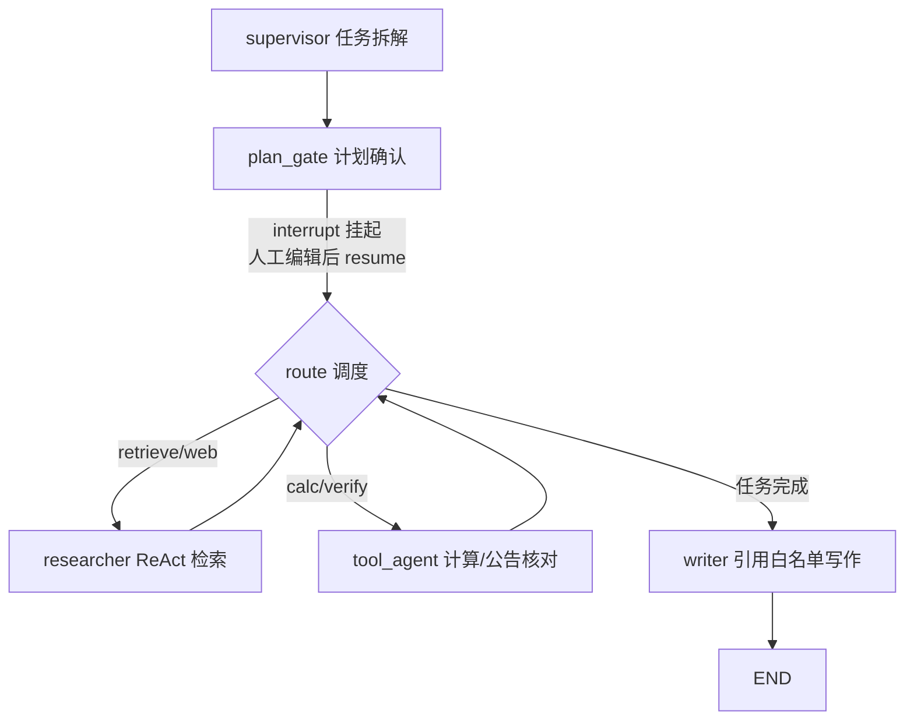

# AutoReport 多智能体自动研报系统

基于 **LangChain 1.x / LangGraph / LangSmith** 的 A 股研报自动分析系统：

```
研报采集 → PDF 解析入库 → 混合检索 → 多智能体分析 → 带引用溯源的报告生成
```

个人毕业项目，用于展示 LLM 应用工程化能力：RAG、多智能体编排、人机协同（HITL）、评测闭环、优雅降级与工程化交付。

## 功能特性

| 模块 | 能力 |
|---|---|
| 数据接入 | inbox 目录导入 + 东财研报直链采集 + 巨潮公告采集，限速/重试/robots 检查，pdf_hash 幂等去重 |
| 解析入库 | PyMuPDF 按页抽取 + 规则/LLM 双通道元数据抽取 + 页级分块；SQLite(FTS5) + Chroma 双存储，状态机可断点续跑 |
| 混合检索 | 实体抽取（代码/名称/指标）→ 向量语义 + FTS5 关键词双通道 → RRF 融合 → 业务重排（实体加分/日期衰减） |
| 引用溯源 | CitationManager 全局编号，每条结论可回跳到「机构/标题/日期/页码/原文链接」，从机制上封死编造来源 |
| 多智能体 | LangGraph 主管-研究员-工具员-写作四角色；结构化输出任务拆解；`interrupt` 计划确认（HITL）；SqliteSaver 检查点 |
| 工具集 | 研报检索 / AST 安全计算（防 LLM 心算出错）/ 巨潮公告交叉核对「预测 vs 实际」/ Tavily 联网（可选） |
| 评测闭环 | 种子评测集自动生成（gold 天然可靠）→ 检索命中率@K / 引用正确率 / LLM-as-judge → Markdown 报告 + 失败案例 |
| 降级设计 | 无 LLM Key / 无嵌入 / 无 LangSmith / 无 Tavily 时逐级降级，核心检索与引用能力始终可用 |
| Web Demo | Streamlit 三页：带引用问答 / 多智能体生成（可编辑计划后恢复）/ 数据统计 |

## 快速开始

### 1. 本地运行（推荐 uv）

```bash
# 安装依赖（Python 3.11+）
uv sync

# 配置密钥：复制 .env.example 为 .env，至少填一个 LLM Key（Qwen 或 DeepSeek）
#   LLM_PROVIDER=qwen / deepseek
#   QWEN_API_KEY=sk-...
# 可选：LANGSMITH_API_KEY（全链路追踪+评测集上传）、TAVILY_API_KEY（联网搜索）

# 导入研报：把 PDF 丢进 data/inbox/ 后执行
uv run autoreport ingest

# 或自动采集（东财研报 / 巨潮年报公告）
uv run autoreport crawl eastmoney --code 601138
uv run autoreport crawl cninfo --code 601138 --ann-type 年报

# 研报问答（带引用）
uv run autoreport ask "601138 的最新评级是什么？"

# 多智能体生成研报（--auto 跳过计划确认）
uv run autoreport report "生成 601138 的投资价值分析报告" --auto

# 评测闭环
uv run autoreport eval --build

# Web Demo
uv run streamlit run src/autoreport/ui/streamlit_app.py
```

### 2. Docker 运行

```bash
cp .env.example .env   # 填好 Key
docker compose up --build
# 浏览器打开 http://localhost:8501
# CLI: docker compose run --rm autoreport autoreport --help
```

## CLI 命令

| 命令 | 说明 |
|---|---|
| `autoreport ingest [path]` | 导入 PDF（默认扫 data/inbox/），`--no-llm-meta` 关闭 LLM 元数据兜底 |
| `autoreport crawl eastmoney/cninfo` | 采集研报/公告，自动解析入库 |
| `autoreport ask "问题"` | 单轮 RAG 问答，`--show-chunks` 查看命中片段 |
| `autoreport report "主题" --auto` | 多智能体生成完整研报 |
| `autoreport eval --build` | 构建/运行评测，输出 `data/eval_output/report_*.md` |
| `autoreport stats` / `index` | 数据统计 / 补建向量索引 |

## 架构

```
src/autoreport/
├── config.py            # pydantic-settings 全局配置（.env 单一入口）
├── llm.py               # ChatOpenAI 工厂：Qwen/DeepSeek 一键切换，main/small 双档控成本
├── data_ingestion/
│   ├── parsers/         # PDF 抽取 / 元数据（规则+LLM 兜底）/ 页级分块
│   ├── storage/         # SQLAlchemy + FTS5(jieba) / Chroma 向量库
│   ├── crawlers/        # 限速重试基类 + 东财/巨潮采集器 + 调度器
│   └── pipeline.py      # hash 幂等入库流水线（状态机：pending→parsed→indexed）
├── retrieval/
│   ├── entity.py        # A 股实体抽取与查询改写（代码/简称/指标词）
│   ├── hybrid_retriever.py  # 双通道 RRF 融合 + 业务重排
│   └── citations.py     # 引用编号管理（防幻觉核心）
├── agents/              # LangGraph 多智能体
│   ├── state.py         # 共享黑板状态（reducer 设计）
│   ├── supervisor.py    # 主管：结构化输出任务拆解
│   ├── researcher.py    # 研究员：create_agent + 检索工具（ReAct）
│   ├── tools_agent.py   # 工具员：计算/公告核对/联网
│   ├── writer.py        # 写作：引用白名单模板化成稿
│   └── graph.py         # StateGraph 组装 + SqliteSaver + HITL interrupt
├── agents/tools/        # search_reports / safe_calc / verify_with_announcement / web_search
├── evaluation/          # 评测集构建 + 指标 + 报告生成
├── qa.py                # 单轮问答轻链路（CLI/UI 共用）
└── ui/streamlit_app.py  # Web Demo
```

多智能体工作流：



## 评测结果（简历数字来源）

`uv run autoreport eval --build` 输出 `data/eval_output/report_*.md`：

- 检索命中率@5 / 引用正确率 / LLM-as-judge 平均分 / 平均延迟
- 逐条明细 JSONL 支持优化前后对比（回归测试）
- LangSmith 配置后评测集自动上传，trace 可视化

> 示例写法：「自建 N 条研报问答评测集，通过评测闭环将检索命中率从 X% 优化到 Y%。」

## 设计决策（为何这样做）

- **为什么混合检索**：研报问答是实体+事实型，纯向量会把语义相近但股票不对的内容排前面；代码精确过滤 + FTS 兜底才保命中率
- **为什么引用白名单**：引用编号在检索时确定、写作时只读 —— 编造的 `[99]` 在引用列表一眼识破
- **为什么 AST 计算器**：LLM tokenizer 对数字不友好，算术必须外置；AST 白名单保证模型输出不直接进解释器
- **为什么 HITL**：研报是高成本高价值产出，计划确认一步把「生成方向错误」的浪费挡在执行前
- **为什么全程降级**：无 Key 也能跑通检索/引用/评测，开发-演示-部署三态平滑

## 免责声明

本项目仅用于个人学习与技术展示，不构成任何投资建议。研报版权归原机构所有，PDF 与索引不入版本库。
